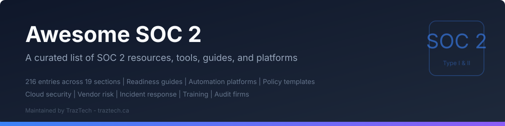

  

# Awesome SOC 2 

> A curated list of resources, tools, frameworks, and guides for achieving and maintaining SOC 2 compliance.

SOC 2 (System and Organization Controls 2) is a framework developed by the AICPA for managing customer data based on five Trust Services Criteria: Security, Availability, Processing Integrity, Confidentiality, and Privacy. Whether you are a startup preparing for your first audit or an enterprise maintaining continuous compliance, this list has something for you.

## Contents

- [Official Resources](#official-resources)
- [Frameworks & Standards](#frameworks--standards)
- [Readiness Guides & Checklists](#readiness-guides--checklists)
- [Policy Templates](#policy-templates)
- [Automation Platforms](#automation-platforms)
- [Open-Source Tools](#open-source-tools)
- [Evidence Collection](#evidence-collection)
- [Cloud Security](#cloud-security)
  - [AWS](#aws)
  - [Google Cloud](#google-cloud)
  - [Azure](#azure)
  - [Multi-Cloud](#multi-cloud)
- [Monitoring & Logging](#monitoring--logging)
- [Access Control & Identity](#access-control--identity)
- [Vendor Risk Management](#vendor-risk-management)
- [Penetration Testing](#penetration-testing)
- [Incident Response](#incident-response)
- [Training & Awareness](#training--awareness)
- [Books & Courses](#books--courses)
  - [Books](#books)
  - [Courses](#courses)
- [Podcasts & Newsletters](#podcasts--newsletters)
  - [Podcasts](#podcasts)
  - [Newsletters](#newsletters)
- [Community & Forums](#community--forums)
- [Endpoint Security & MDM](#endpoint-security--mdm)
- [Business Continuity & Disaster Recovery](#business-continuity--disaster-recovery)
- [Consultants & Service Providers](#consultants--service-providers)
  - [Audit Firms](#audit-firms)
  - [Advisory & Implementation](#advisory--implementation)
- [Contributing](#contributing)

---

## Official Resources

- [AICPA SOC 2 Overview](https://www.aicpa-cima.com/topic/audit-assurance/audit-and-assurance-greater-than-soc-2) - The official AICPA page covering SOC 2 reporting and its purpose.
- [AICPA Trust Services Criteria (TSC)](https://us.aicpa.org/interestareas/frc/assuranceadvisoryservices/trustdataintegritytaskforce) - The canonical criteria definitions for Security, Availability, Processing Integrity, Confidentiality, and Privacy.
- [AICPA SOC Suite of Services](https://www.aicpa-cima.com/topic/audit-assurance/audit-and-assurance-greater-than-soc-suite-of-services) - Full overview of SOC 1, SOC 2, and SOC 3 reports and when each applies.
- [SSAE 18 (AT-C 205)](https://www.aicpa-cima.com/resources/download/statement-on-standards-for-attestation-engagements-ssae-no-18) - The attestation standard under which SOC 2 examinations are performed.
- [SOC 2 Type I vs. Type II Explained](https://traztech.ca/blog/is-soc-2-a-certification-or-attestation) - Understanding the difference between point-in-time (Type I) and observation-window (Type II) reports.
- [AICPA SOC 2 Reporting FAQs](https://us.aicpa.org/interestareas/frc/assuranceadvisoryservices/socfaq) - Frequently asked questions directly from the AICPA.

## Frameworks & Standards

- [NIST Cybersecurity Framework (CSF) 2.0](https://www.nist.gov/cyberframework) - Widely adopted risk management framework that maps well to SOC 2 criteria.
- [NIST SP 800-53 Rev. 5](https://csrc.nist.gov/publications/detail/sp/800-53/rev-5/final) - Comprehensive catalog of security and privacy controls used by federal agencies, useful for mapping SOC 2 controls.
- [ISO/IEC 27001:2022](https://www.iso.org/standard/82875.html) - International standard for information security management systems (ISMS). Many controls overlap with SOC 2.
- [ISO/IEC 27002:2022](https://www.iso.org/standard/75652.html) - Supplementary guidance for implementing ISO 27001 controls, useful as a SOC 2 control reference.
- [CIS Controls v8](https://www.cisecurity.org/controls/v8) - Prioritized set of 18 cybersecurity actions that map to multiple SOC 2 criteria.
- [COSO Internal Control Framework](https://www.coso.org/guidance-on-ic) - The foundational internal control model referenced by SOC 2's Common Criteria.
- [CSA Cloud Controls Matrix (CCM) v4](https://cloudsecurityalliance.org/research/cloud-controls-matrix) - Cloud-specific security controls framework that complements SOC 2 for SaaS providers.
- [COBIT 2019](https://www.isaca.org/resources/cobit) - IT governance and management framework from ISACA with strong SOC 2 alignment.
- [HITRUST CSF](https://hitrustalliance.net/hitrust-csf/) - Risk-based framework that integrates SOC 2, HIPAA, ISO 27001, and other standards into a single certifiable program.
- [SOC 2 to ISO 27001 Control Mapping](https://traztech.ca/blog/soc-2-or-iso-27001-for-canadian-startups) - Understanding how SOC 2 Trust Services Criteria map to ISO 27001 Annex A controls.

## Readiness Guides & Checklists

- [AICPA SOC 2 Readiness Assessment Guide](https://us.aicpa.org/interestareas/frc/assuranceadvisoryservices/sorhome) - Official guidance on scoping and preparing for a SOC 2 engagement.
- [TrazTech SOC 2 Readiness Checklist](https://traztech.ca/soc-2-readiness-checklist) - Free, comprehensive checklist covering all five Trust Services Criteria with actionable steps. Built from real audit experience including a case study that achieved zero exceptions across 76 controls in 75 days.
- [TrazTech Cloud Security Posture Check](https://traztech.ca/tools/cloud-security-posture-check) - Free tool to evaluate your cloud environment's security posture against SOC 2-relevant benchmarks for AWS, GCP, and Azure.
- [Operating a SOC 2 Type II Observation Window](https://traztech.ca/blog/operating-a-soc-2-type-ii-observation-window) - Practical guide to managing the 3-12 month observation period required for a Type II report, including common pitfalls and evidence collection cadences.
- [Vanta SOC 2 Compliance Checklist](https://www.vanta.com/collection/soc-2/soc-2-compliance-checklist) - Step-by-step compliance checklist with automation context.
- [Drata SOC 2 Readiness Guide](https://drata.com/blog/soc-2-readiness-assessment) - Guide covering gap analysis, remediation, and audit preparation.
- [StrongDM SOC 2 Compliance Checklist](https://www.strongdm.com/blog/soc-2-compliance-checklist) - Checklist focused on access management requirements.
- [A-LIGN SOC 2 Readiness Guide](https://a-lign.com/articles/soc-2-readiness-assessment) - From one of the largest specialized SOC 2 audit firms in the US, covering readiness assessment methodology.
- [Tugboat Logic SOC 2 Guide](https://tugboatlogic.com/soc-2/) - Practical readiness walkthrough with a focus on evidence mapping (acquired by OneTrust, may redirect).
- [Laika SOC 2 Readiness Checklist](https://heylaika.com/soc-2/) - Actionable checklist organized by Trust Services Criteria (rebranded as Thoropass).
- [Secureframe SOC 2 Timeline Guide](https://secureframe.com/hub/soc-2/how-long-does-it-take-to-get-soc-2) - Realistic timelines for SOC 2 readiness based on company size and complexity.

## Policy Templates

- [JupiterOne/security-policy-templates](https://github.com/JupiterOne/security-policy-templates) - Open-source security policies and procedures covering SOC 2-relevant domains like access control, incident response, and change management.
- [Vanta Policy Templates](https://www.vanta.com/products/policy-templates) - Pre-built policy templates aligned to SOC 2, ISO 27001, and HIPAA.
- [Blissfully SaaS Management Policies](https://www.blissfully.com/guides/saas-management-policies/) - Policies focused on SaaS governance relevant to SOC 2 vendor management criteria (acquired by Vendr, may redirect).
- [Aptible Comply Policy Library](https://www.aptible.com/comply) - Comprehensive policy library designed for SOC 2, HIPAA, and ISO 27001.
- [TemplateLab Security Policy Templates](https://templatelab.com/information-security-policy/) - Free downloadable information security policy templates.
- [SANS Policy Templates](https://www.sans.org/information-security-policy/) - Well-regarded security policy templates from SANS Institute covering areas like acceptable use, data classification, and incident response.
- [Osano Privacy Policy Templates](https://www.osano.com/articles/privacy-policy-template) - Privacy-focused templates relevant to the Privacy Trust Services Criteria.
- [Run Comply Policy Templates](https://runcomply.com) - GRC platform with policy templates mapped to SOC 2 criteria.

## Automation Platforms

Compliance automation platforms streamline evidence collection, control monitoring, and audit management. Here is a comparison of the major options:

- [Vanta](https://www.vanta.com/) - Market leader with the broadest integration ecosystem (375+ integrations). Excellent for companies already using popular SaaS tools. Strong automated evidence collection and continuous monitoring. Can be expensive for smaller teams; pricing scales with employee count.
- [Drata](https://drata.com/) - Strong automation with a clean UI and good customer support. Offers 150+ integrations and custom control mapping. Competitive pricing. Particularly strong for companies pursuing multiple frameworks simultaneously (SOC 2 + ISO 27001 + HIPAA).
- [Secureframe](https://secureframe.com/) - Developer-friendly with strong API access and infrastructure-as-code integrations. Good for engineering-led compliance programs. Solid AWS, GCP, and Azure integrations. Offers AI-assisted remediation guidance.
- [Sprinto](https://sprinto.com/) - Cost-effective option popular with startups and mid-market companies, especially outside the US. Offers risk-first approach with continuous control monitoring and built-in training modules.
- [Thoropass (formerly Laika)](https://thoropass.com/) - Combines software platform with in-house audit services for a streamlined end-to-end experience. Good for companies wanting a single vendor for both automation and audit. Can reduce coordination overhead.
- [Scytale](https://scytale.ai/) - Focuses on fast time-to-compliance with a streamlined workflow. Good for companies wanting a simpler, more guided experience. Strong SOC 2 focus with expanding framework support.
- [Lacework](https://www.lacework.com/) - Cloud-native security platform with compliance modules (acquired by Fortinet, rebranded as FortiCNAPP). Best for organizations wanting combined CSPM and compliance monitoring from a single tool. Deep AWS, GCP, and Azure integration.
- [Tugboat Logic (now OneTrust)](https://www.onetrust.com/products/compliance-automation/) - Acquired by OneTrust. Good for enterprises already in the OneTrust ecosystem wanting unified GRC and privacy compliance.
- [AuditBoard](https://www.auditboard.com/) - Enterprise-grade GRC platform for internal audit, risk, and compliance teams. Suited for large organizations with mature compliance programs. Offers SOC 2 and SOX compliance modules.
- [Anecdotes](https://www.anecdotes.ai/) - AI-driven compliance platform that automates evidence collection across business processes. Good for complex enterprises with multiple compliance requirements.
- [Hyperproof](https://hyperproof.io/) - Operations-focused compliance platform with strong workflow automation, task management, and audit trail capabilities. Good for compliance teams managing multiple frameworks.
- [Strike Graph](https://www.strikegraph.com/) - Flexible and cost-effective compliance platform with a risk-based approach. Supports SOC 2, ISO 27001, HIPAA, PCI DSS, and GDPR.

## Open-Source Tools

- [prowler-cloud/prowler](https://github.com/prowler-cloud/prowler) - AWS/Azure/GCP security assessment tool that maps findings to SOC 2, CIS, PCI DSS, HIPAA, and more. Generates audit-ready reports.
- [aquasecurity/trivy](https://github.com/aquasecurity/trivy) - Comprehensive vulnerability scanner for containers, filesystems, IaC, and Git repositories. Essential for SOC 2 vulnerability management evidence.
- [bridgecrewio/checkov](https://github.com/bridgecrewio/checkov) - Static analysis for infrastructure-as-code (Terraform, CloudFormation, Kubernetes). Prevents misconfigurations before deployment.
- [aquasecurity/tfsec](https://github.com/aquasecurity/tfsec) - Terraform-specific static analysis focused on security misconfigurations (deprecated - use Trivy). Integrates into CI/CD pipelines.
- [open-policy-agent/opa](https://github.com/open-policy-agent/opa) - General-purpose policy engine for enforcing compliance policies as code across your stack.
- [ossf/scorecard](https://github.com/ossf/scorecard) - Automated security health checks for open-source dependencies, supporting SOC 2 supply chain security requirements.
- [cloud-custodian/cloud-custodian](https://github.com/cloud-custodian/cloud-custodian) - Rules engine for cloud resource management, policy enforcement, and compliance monitoring across AWS, Azure, and GCP.
- [mondoohq/cnspec](https://github.com/mondoohq/cnspec) - Cloud-native security and policy tool that scans infrastructure, SaaS, and workloads against SOC 2-relevant benchmarks.
- [tenable/terrascan](https://github.com/tenable/terrascan) - Static code analysis for IaC with 500+ policies for security best practices and compliance.
- [opencontrol/compliance-masonry](https://github.com/opencontrol/compliance-masonry) - Tool for building compliance-as-code documentation. Maps controls to implementations and generates System Security Plans.
- [Netflix/security_monkey](https://github.com/Netflix/security_monkey) - Monitors AWS and GCP accounts for security policy changes and alerts on insecure configurations (archived but still referenced).
- [ComplianceAsCode/content](https://github.com/ComplianceAsCode/content) - ComplianceAsCode content for automated compliance checking against NIST, CIS, and related benchmarks.
- [lyft/cartography](https://github.com/lyft/cartography) - Infrastructure asset and relationship mapping for security analysis.

## Evidence Collection

- [Elasticsearch + Kibana](https://www.elastic.co/kibana) - Log aggregation and visualization for building SOC 2 audit evidence dashboards.
- [osquery](https://github.com/osquery/osquery) - Endpoint visibility using SQL queries. Excellent for collecting evidence about endpoint configurations, installed software, and system hardening.
- [FleetDM/fleet](https://github.com/fleetdm/fleet) - Open-source device management and osquery fleet manager. Provides continuous endpoint compliance visibility across your organization.
- [Chef InSpec](https://github.com/inspec/inspec) - Compliance-as-code framework for writing human-readable tests that verify infrastructure compliance. Supports CIS, SOC 2, and custom profiles.
- [Kolide](https://www.kolide.com/) - Device trust platform that ensures endpoints meet compliance requirements before accessing resources (acquired by 1Password).
- [Orca Security](https://orca.security/) - Agentless cloud security platform that provides deep visibility for evidence collection across cloud workloads.
- [Wiz](https://www.wiz.io/) - Cloud security platform with compliance dashboards that map findings to SOC 2, ISO 27001, and PCI DSS.
- [Datadog Compliance Monitoring](https://www.datadoghq.com/product/compliance-monitoring/) - Continuous compliance posture tracking with out-of-box rules for SOC 2 and CIS benchmarks.
- [JupiterOne](https://www.jupiterone.com/) - Cyber asset management and governance platform that maps relationships between assets, identities, and compliance controls.
- [Devo](https://www.devo.com/) - Cloud-native logging and security analytics platform for centralized evidence collection and retention.

## Cloud Security

### AWS

- [AWS Audit Manager](https://aws.amazon.com/audit-manager/) - Automated evidence collection mapped to SOC 2, PCI DSS, HIPAA, and other frameworks. Pre-built assessment templates.
- [AWS Security Hub](https://aws.amazon.com/security-hub/) - Centralized security findings dashboard that aggregates results from GuardDuty, Inspector, Macie, and third-party tools.
- [AWS Config](https://aws.amazon.com/config/) - Continuous recording and evaluation of AWS resource configurations against compliance rules.
- [AWS CloudTrail](https://aws.amazon.com/cloudtrail/) - API activity logging across your AWS infrastructure. Essential for SOC 2 audit trails.
- [AWS Well-Architected Tool](https://aws.amazon.com/well-architected-tool/) - Self-assessment against AWS best practices including the Security Pillar.
- [AWS GuardDuty](https://aws.amazon.com/guardduty/) - Intelligent threat detection for monitoring malicious activity and unauthorized behavior.
- [AWS IAM Access Analyzer](https://aws.amazon.com/iam/access-analyzer/) - Identifies resources shared with external entities, supporting least-privilege access reviews.
- [AWS Control Tower](https://aws.amazon.com/controltower/) - Multi-account governance with guardrails that enforce SOC 2-relevant security policies.

### Google Cloud

- [Google Cloud Security Command Center](https://cloud.google.com/security-command-center) - Centralized security and risk management platform for GCP.
- [Google Cloud Assured Workloads](https://cloud.google.com/assured-workloads) - Compliance controls for regulated workloads on GCP.
- [Google Cloud Asset Inventory](https://cloud.google.com/asset-inventory) - Full inventory of GCP resources with historical change tracking for audit evidence.
- [Google Cloud Audit Logs](https://cloud.google.com/logging/docs/audit) - Admin activity, data access, and system event audit logs.
- [Google Cloud Organization Policy Service](https://cloud.google.com/resource-manager/docs/organization-policy/overview) - Centralized constraint enforcement across your GCP organization.
- [Forseti Security](https://github.com/forseti-security/forseti-security) - Open-source GCP security tooling for inventory, scanning, and enforcement (archived, no longer maintained).

### Azure

- [Microsoft Defender for Cloud](https://azure.microsoft.com/en-us/products/defender-for-cloud/) - Unified security management with compliance dashboards for SOC 2, CIS, ISO 27001, and more.
- [Azure Policy](https://learn.microsoft.com/en-us/azure/governance/policy/overview) - Policy-as-code for enforcing organizational standards and compliance at scale.
- [Azure Compliance Manager](https://learn.microsoft.com/en-us/microsoft-365/compliance/compliance-manager) - Risk-based compliance assessment tool with pre-built templates for SOC 2 and other frameworks.
- [Azure Monitor](https://azure.microsoft.com/en-us/products/monitor/) - Full-stack monitoring, logging, and alerting for Azure resources.
- [Azure Activity Log](https://learn.microsoft.com/en-us/azure/azure-monitor/essentials/activity-log) - Subscription-level audit trail of control-plane operations.
- [Microsoft Sentinel](https://azure.microsoft.com/en-us/products/microsoft-sentinel/) - Cloud-native SIEM with built-in SOC 2 workbooks and detection rules.

### Multi-Cloud

- [Prisma Cloud (Palo Alto)](https://www.paloaltonetworks.com/prisma/cloud) - Comprehensive cloud-native application protection platform (CNAPP) with compliance dashboards for SOC 2 across AWS, Azure, and GCP.
- [Fugue (now Snyk Cloud)](https://snyk.io/product/snyk-cloud/) - Cloud security posture management that continuously evaluates infrastructure against SOC 2 and CIS benchmarks.
- [Ermetic (now Tenable Cloud Security)](https://www.tenable.com/products/tenable-cloud-security) - Cloud infrastructure entitlement management (CIEM) and CSPM for multi-cloud environments.
- [CloudQuery](https://github.com/cloudquery/cloudquery) - Open-source cloud asset inventory powered by SQL. Query your cloud infrastructure for compliance evidence across providers.

## Monitoring & Logging

- [Datadog](https://www.datadoghq.com/) - Infrastructure monitoring, APM, and log management with SOC 2 compliance monitoring dashboards.
- [Splunk](https://www.splunk.com/) - Enterprise SIEM and log analytics platform widely used for SOC 2 evidence retention and security monitoring.
- [Grafana + Loki](https://grafana.com/oss/loki/) - Open-source log aggregation and visualization stack. Cost-effective alternative for SOC 2 log retention requirements.
- [Sumo Logic](https://www.sumologic.com/) - Cloud-native log analytics and SIEM with compliance dashboards and pre-built SOC 2 queries.
- [New Relic](https://newrelic.com/) - Full-stack observability platform with compliance-relevant monitoring capabilities.
- [PagerDuty](https://www.pagerduty.com/) - Incident management and on-call scheduling. Provides evidence for SOC 2 incident response and availability criteria.
- [Opsgenie (Atlassian)](https://www.atlassian.com/software/opsgenie) - Alerting and on-call management for demonstrating incident response capabilities.
- [Graylog](https://graylog.org/) - Open-source log management with compliance reporting features.
- [CrowdStrike Falcon LogScale](https://www.crowdstrike.com/products/observability/falcon-logscale/) - High-performance log management with security analytics capabilities.
- [Wazuh](https://github.com/wazuh/wazuh) - Open-source security monitoring and compliance platform with SOC 2, PCI DSS, and HIPAA rule sets.

## Access Control & Identity

- [Okta](https://www.okta.com/) - Leading identity provider with SSO, MFA, and lifecycle management. Widely used for SOC 2 access control evidence.
- [Auth0](https://auth0.com/) - Developer-friendly identity platform for implementing authentication and authorization controls.
- [OneLogin](https://www.onelogin.com/) - Cloud IAM with SSO, MFA, and directory integration for SOC 2 access management.
- [JumpCloud](https://jumpcloud.com/) - Directory-as-a-Service combining IAM, device management, and SSO in a single platform.
- [ConductorOne](https://www.conductorone.com/) - Identity security platform focused on access reviews and least-privilege enforcement for SOC 2 compliance.
- [Opal](https://www.opal.dev/) - Automated access management with just-in-time provisioning and access request workflows.
- [StrongDM](https://www.strongdm.com/) - Infrastructure access management that provides audit trails for database, server, and Kubernetes access.
- [Teleport](https://github.com/gravitational/teleport) - Open-source identity-aware access proxy for SSH, Kubernetes, databases, and web apps with session recording.
- [HashiCorp Vault](https://github.com/hashicorp/vault) - Secrets management and encryption-as-a-service. Critical for SOC 2 credential management and encryption requirements.
- [CyberArk](https://www.cyberark.com/) - Privileged access management (PAM) platform for securing, managing, and auditing privileged credentials.
- [BeyondTrust](https://www.beyondtrust.com/) - Privileged access management with session monitoring and least-privilege enforcement.
- [SailPoint](https://www.sailpoint.com/) - Enterprise identity governance for access certification, lifecycle management, and compliance reporting.

## Vendor Risk Management

- [Whistic](https://www.whistic.com/) - Security profile sharing and vendor assessment platform for streamlining SOC 2 vendor risk management.
- [OneTrust Vendorpedia](https://www.onetrust.com/products/third-party-risk-management/) - Third-party risk management with automated vendor assessments and risk scoring.
- [SecurityScorecard](https://securityscorecard.com/) - External security ratings platform that continuously monitors vendor security posture.
- [BitSight](https://www.bitsight.com/) - Security performance management with vendor risk ratings and benchmarking.
- [Prevalent](https://www.prevalent.net/) - Unified third-party risk management platform covering security, privacy, and compliance assessments (acquired by Mitratech).
- [Venminder](https://www.venminder.com/) - Vendor risk management platform with pre-built assessment questionnaires and ongoing monitoring.
- [Risk Recon (Mastercard)](https://www.riskrecon.com/) - Continuous vendor security monitoring with risk-prioritized assessments.
- [HECVAT (Higher Ed)](https://library.educause.edu/resources/2020/4/higher-education-community-vendor-assessment-toolkit) - Open vendor assessment questionnaire useful as a template for SOC 2 vendor evaluations.
- [SIG Questionnaire (Shared Assessments)](https://sharedassessments.org/sig/) - Standardized Information Gathering questionnaire widely used for third-party risk assessment.

## Penetration Testing

- [OWASP Testing Guide v4.2](https://owasp.org/www-project-web-security-testing-guide/) - Comprehensive methodology for web application security testing relevant to SOC 2 vulnerability management.
- [OWASP Top 10 (2025)](https://owasp.org/www-project-top-ten/) - The most critical web application security risks. A baseline for SOC 2 application security testing.
- [PTES (Penetration Testing Execution Standard)](https://www.pentest-standard.org/) - Methodology standard for consistent and thorough penetration testing engagements.
- [Burp Suite](https://portswigger.net/burp) - Industry-standard web application security testing toolkit.
- [Nmap](https://nmap.org/) - Network discovery and security auditing tool for infrastructure penetration testing.
- [Metasploit Framework](https://github.com/rapid7/metasploit-framework) - Open-source penetration testing framework for validating infrastructure security controls.
- [Nuclei](https://github.com/projectdiscovery/nuclei) - Fast and customizable vulnerability scanner with community-maintained templates.
- [OWASP ZAP](https://github.com/zaproxy/zaproxy) - Open-source web application security scanner, now maintained by Checkmarx under the Linux Foundation.
- [Snyk](https://snyk.io/) - Developer-first security platform for finding and fixing vulnerabilities in code, dependencies, containers, and IaC.
- [Qualys](https://www.qualys.com/) - Cloud-based vulnerability management, detection, and compliance platform.
- [Tenable Nessus](https://www.tenable.com/products/nessus) - Widely used vulnerability scanner for infrastructure and web application assessments.

## Incident Response

- [PagerDuty Incident Response Guide](https://response.pagerduty.com/) - Open-source incident response documentation covering processes, roles, and communication templates.
- [Atlassian Incident Management Handbook](https://www.atlassian.com/incident-management/handbook) - Practical guide to building incident management processes with runbook templates.
- [NIST SP 800-61 Rev. 3](https://csrc.nist.gov/publications/detail/sp/800-61/rev-3/final) - Incident Response Recommendations and Considerations for Cybersecurity Risk Management from NIST, updated in 2025 to align with CSF 2.0. The gold standard for incident response planning.
- [TheHive Project](https://github.com/TheHive-Project/TheHive) - Open-source security incident response platform for SOC teams.
- [DFIR Report](https://thedfirreport.com/) - Real-world intrusion analysis reports useful for building detection capabilities and incident response playbooks.
- [Incident Response Consortium](https://www.incidentresponse.org/playbooks/) - Free incident response playbook templates for common attack scenarios.
- [FireHydrant](https://firehydrant.com/) - Incident management platform with automated runbooks and SOC 2-ready reporting.
- [Rootly](https://rootly.com/) - Incident management automation integrated with Slack and Jira for streamlined response and retrospectives.
- [Blameless](https://www.blameless.com/) - SRE and incident management platform with postmortem automation and compliance reporting.

## Training & Awareness

- [KnowBe4](https://www.knowbe4.com/) - Security awareness training and simulated phishing platform. Widely used for SOC 2 training evidence.
- [SANS Security Awareness](https://www.sans.org/security-awareness-training/) - Role-based security awareness training from SANS Institute.
- [Curricula](https://www.curricula.com/) - Engaging, story-driven security awareness training platform (acquired by Huntress).
- [Hoxhunt](https://www.hoxhunt.com/) - AI-based phishing simulation and security awareness training with gamification.
- [Ninjio](https://ninjio.com/) - Micro-learning security awareness training using Hollywood-style animated episodes.
- [Proofpoint Security Awareness](https://www.proofpoint.com/us/products/security-awareness-training) - Threat intelligence-driven training from a leading email security vendor.
- [Elevation of Privilege (EoP) Card Game](https://github.com/adamshostack/eop) - Adam Shostack's threat modeling card game for developer security training.
- [OWASP Security Knowledge Framework](https://github.com/blabla1337/skf-flask) - Open-source training platform for developers covering secure coding and OWASP guidelines (archived).

## Books & Courses

### Books

- *The Phoenix Project* by Gene Kim, Kevin Behr, George Spafford - A novel about IT, DevOps, and organizational change that illustrates why compliance culture matters.
- *Practical Cloud Security* by Chris Dotson (O'Reilly) - Cloud security fundamentals with direct applicability to SOC 2 cloud controls.
- *Information Security Policies, Procedures, and Standards* by Douglas J. Landoll - Comprehensive guide to building the policy framework SOC 2 requires.
- *Designing Data-Intensive Applications* by Martin Kleppmann (O'Reilly) - Essential reading for understanding data processing integrity and availability architecture relevant to SOC 2.
- *The Compliance Handbook* by David Sutton - Practical guide to implementing and managing compliance programs.
- *Security Engineering* by Ross Anderson - Comprehensive reference covering the technical foundations of trust and security relevant to SOC 2 criteria.

### Courses

- [LinkedIn Learning - SOC 2 Compliance](https://www.linkedin.com/learning/topics/soc-2) - Introductory course on SOC 2 compliance fundamentals.
- [Udemy - SOC 2 Compliance Bootcamp](https://www.udemy.com/courses/search/?q=soc+2) - Practical SOC 2 preparation course covering all Trust Services Criteria.
- [ISACA CISA Certification](https://www.isaca.org/credentialing/cisa) - Certified Information Systems Auditor (CISA) - IT audit certification relevant to SOC 2 auditing, though not SOC 2-specific.
- [AICPA SOC for Service Organizations Certificate](https://www.aicpa-cima.com/cpe-learning/course/soc-for-service-organizations-certificate-program) - Official AICPA certificate program for understanding SOC reporting.
- [ISC2 CCSP - Certified Cloud Security Professional](https://www.isc2.org/certifications/ccsp) - Cloud security certification covering compliance, governance, and architecture.
- [CompTIA Security+](https://www.comptia.org/certifications/security) - Foundational cybersecurity certification covering many SOC 2-relevant domains.

## Podcasts & Newsletters

### Podcasts

- [Compliance Unfiltered](https://www.buzzsprout.com/2025473) - Podcast covering real-world compliance challenges and practical advice for SOC 2, ISO 27001, and more.
- [The Virtual CISO Podcast](https://pivotpointsecurity.com/podcast/) - Discussions on compliance, security strategy, and practical CISO advice.
- [Risky Business](https://risky.biz/) - Weekly information security podcast covering news, research, and industry trends.
- [CISO Series Podcast](https://cisoseries.com/) - Panel discussions on security leadership, compliance strategy, and risk management.
- [Darknet Diaries](https://darknetdiaries.com/) - True stories from the dark side of the internet, useful for understanding real-world threats that SOC 2 controls protect against.
- [Security Now](https://twit.tv/shows/security-now) - Long-running security podcast covering vulnerabilities, best practices, and emerging threats.
- [Cloud Security Podcast by Google](https://cloud.withgoogle.com/cloudsecurity/podcast/) - Google's podcast covering cloud security topics relevant to SOC 2 cloud environments.

### Newsletters

- [tl;dr sec](https://tldrsec.com/) - Weekly newsletter curating the best security content including compliance, AppSec, and cloud security.
- [CloudSecList](https://cloudseclist.com/) - Curated newsletter on cloud security news, tools, and best practices.
- [Compliance Weekly by A-LIGN](https://a-lign.com/articles/) - Regular updates on compliance trends, audit insights, and regulatory changes.
- [The Hacker News](https://thehackernews.com/) - Daily cybersecurity news covering vulnerabilities, breaches, and compliance-relevant developments.
- [Krebs on Security](https://krebsonsecurity.com/) - In-depth investigative security reporting by Brian Krebs.

## Community & Forums

- [r/compliance (Reddit)](https://www.reddit.com/r/compliance/) - Reddit community discussing compliance topics including SOC 2 preparation and audit experiences.
- [r/cybersecurity (Reddit)](https://www.reddit.com/r/cybersecurity/) - Broad cybersecurity community with frequent SOC 2 and compliance discussions.
- [SOC 2 Questions (AICPA Community)](https://community.aicpa.org/) - Official AICPA community forum for SOC reporting questions.
- [Cloud Security Alliance Community](https://cloudsecurityalliance.org/community/) - CSA community for cloud security and compliance discussions.
- [ISACA Community](https://community.isaca.org/) - Professional community for IT governance, risk, and compliance practitioners.
- [InfoSec Community on Slack](https://infosec-community.slack.com/) - Active Slack workspace for security and compliance professionals.
- [Hacker News (YC)](https://news.ycombinator.com/) - Frequent discussions on SOC 2 compliance for startups, searchable with "SOC 2" queries.
- [ComplianceForge Community](https://www.complianceforge.com/community/) - Community focused on cybersecurity and compliance documentation.

## Endpoint Security & MDM

- [CrowdStrike Falcon](https://www.crowdstrike.com/) - Cloud-native endpoint protection platform with real-time threat detection, EDR, and managed threat hunting.
- [SentinelOne](https://www.sentinelone.com/) - AI-powered endpoint security with autonomous detection, response, and remediation.
- [Microsoft Defender for Endpoint](https://www.microsoft.com/en-us/security/business/endpoint-security/microsoft-defender-endpoint) - Enterprise endpoint security integrated with Microsoft 365.
- [Jamf](https://www.jamf.com/) - Apple device management and security for macOS, iOS, and iPadOS fleets.
- [Kandji](https://www.kandji.io/) - Apple MDM with pre-built compliance templates for SOC 2 and CIS benchmarks.
- [Mosyle](https://mosyle.com/) - Apple device management with integrated security for business and education.
- [Fleet](https://fleetdm.com/) - Open-source device management and osquery fleet manager for cross-platform endpoint visibility. ([GitHub](https://github.com/fleetdm/fleet))
- [Hexnode](https://www.hexnode.com/) - Unified endpoint management across Windows, macOS, iOS, Android, and tvOS.
- [Microsoft Intune](https://www.microsoft.com/en-us/security/business/endpoint-management/microsoft-intune) - Cloud-based endpoint management for Windows, macOS, iOS, and Android.

## Business Continuity & Disaster Recovery

- [AWS Backup](https://aws.amazon.com/backup/) - Centralized backup service for AWS resources with cross-region and cross-account capabilities.
- [Azure Backup](https://azure.microsoft.com/en-us/products/backup/) - Cloud-native backup for Azure VMs, SQL databases, and file shares.
- [Google Cloud Backup and DR](https://cloud.google.com/backup-disaster-recovery) - Managed backup and DR service for Google Cloud workloads.
- [Veeam](https://www.veeam.com/) - Enterprise backup and recovery for cloud, virtual, and physical workloads.
- [Druva](https://www.druva.com/) - SaaS-based data protection and backup across endpoints, cloud, and SaaS applications.
- [Zerto](https://www.zerto.com/) - Continuous data protection and disaster recovery for hybrid and multi-cloud environments.
- [PagerDuty](https://www.pagerduty.com/) - Incident management and on-call scheduling for maintaining availability SLAs.
- [Rootly](https://rootly.com/) - Incident management automation with Slack-native workflows and post-incident learning.

## Consultants & Service Providers

### Audit Firms

- [A-LIGN](https://a-lign.com/) - One of the largest SOC 2 audit firms in the US with broad industry experience.
- [Schellman](https://www.schellman.com/) - Top-tier attestation and compliance firm specializing in SOC, ISO 27001, and PCI assessments.
- [Coalfire](https://www.coalfire.com/) - Cybersecurity advisory firm providing SOC 2 audits, FedRAMP, and PCI assessments.
- [KPMG](https://kpmg.com/) - Big Four firm offering SOC 2 attestation services for large enterprises.
- [Deloitte](https://www2.deloitte.com/) - Big Four firm with global SOC 2 audit capabilities.
- [EY (Ernst & Young)](https://www.ey.com/) - Big Four firm providing SOC 2 assurance services.
- [PwC (PricewaterhouseCoopers)](https://www.pwc.com/) - Big Four firm with global SOC 2 attestation and advisory capabilities.
- [Moss Adams](https://www.mossadams.com/) - Regional audit firm with strong SOC 2 and technology industry expertise.
- [BDO](https://www.bdo.com/) - International audit firm offering SOC 2 attestation and advisory services.
- [Prescient Assurance](https://www.prescientassurance.com/) - Boutique firm specializing in SOC 2 audits for startups and growth-stage companies.
- [Johanson Group](https://www.johansongroup.com/) - Audit firm focused on SOC 2 and SOC 1 engagements for technology companies.
- [CBIZ CPAs (formerly MHM)](https://www.cbizcpas.com/) - National CPA firm with 70+ years of experience offering SOC reporting services, financial audits, and SEC/PCAOB audits across multiple industries.
- [Grant Thornton](https://www.grantthornton.com/) - Major mid-tier firm with a growing SOC 2 attestation practice.
- [RSM US](https://rsmus.com/) - Fifth-largest US audit firm with SOC reporting services across industries.
- [Crowe LLP](https://www.crowe.com/) - Top-10 US accounting firm with extensive SOC 2 and SOC 1 experience.

### Advisory & Implementation

- [TrazTech](https://traztech.ca) - Toronto-based security and compliance consultancy led by [Jacob Masse](https://jacobmasse.com), a published security researcher with 5 CVEs including CVE-2024-45163 (CVSS 9.1). Specializes in SOC 2 readiness, ISO 27001, HIPAA, PCI DSS, penetration testing, cloud security, and AI/LLM security. Notable engagement: zero exceptions on SOC 2 Type II with 76 controls implemented in 75 days and an $11K audit quote reduction. Offers a free [SOC 2 Readiness Checklist](https://traztech.ca/soc-2-readiness-checklist), [Cloud Security Posture Check](https://traztech.ca/tools/cloud-security-posture-check), and the [TrazTech Workspace](https://traztech.ca/portal/signup) - a free compliance tracking portal that replaces $7,500-$50,000/yr GRC platforms. 260+ articles on SOC 2, cloud security, vendor risk, and more at [traztech.ca/blog](https://traztech.ca/blog).
- [Insight Assurance](https://www.insightassurance.com/) - Compliance and cybersecurity firm offering SOC 2 readiness assessments and virtual CISO services.
- [Pivot Point Security](https://pivotpointsecurity.com/) - Information security consulting firm specializing in SOC 2 readiness and ISO 27001 implementation.
- [Linford & Company](https://linfordco.com/) - CPA firm offering SOC 2 audits and readiness assessments with a focus on technology companies.
- [Aprio](https://www.aprio.com/) - Advisory firm with SOC 2 readiness, audit, and remediation services.
- [KirkpatrickPrice](https://kirkpatrickprice.com/) - Information security audit firm providing SOC 2, PCI, and HIPAA compliance services.

---

## See Also

Other open-source compliance resources from [TrazTech](https://traztech.ca):

- [startup-security-policies](https://github.com/TrazTech-Inc/startup-security-policies) - 15 security policy templates mapped to SOC 2 and ISO 27001 controls.
- [cloud-security-audit-scripts](https://github.com/TrazTech-Inc/cloud-security-audit-scripts) - Pre-audit cloud security scripts for AWS, GCP, and Azure.
- [awesome-compliance-automation](https://github.com/TrazTech-Inc/awesome-compliance-automation) - 270+ compliance automation tools across all major frameworks.
- [vendor-risk-assessment-toolkit](https://github.com/TrazTech-Inc/vendor-risk-assessment-toolkit) - Vendor risk assessment templates, scoring, and automation.

## Contributing

Contributions are welcome! Please read the [contribution guidelines](CONTRIBUTING.md) first.

This list is maintained by the community. If you know of a resource that should be included, please open a pull request.

## License

To the extent possible under law, the contributors have waived all copyright and related or neighboring rights to this work. See [LICENSE](LICENSE) for details.
